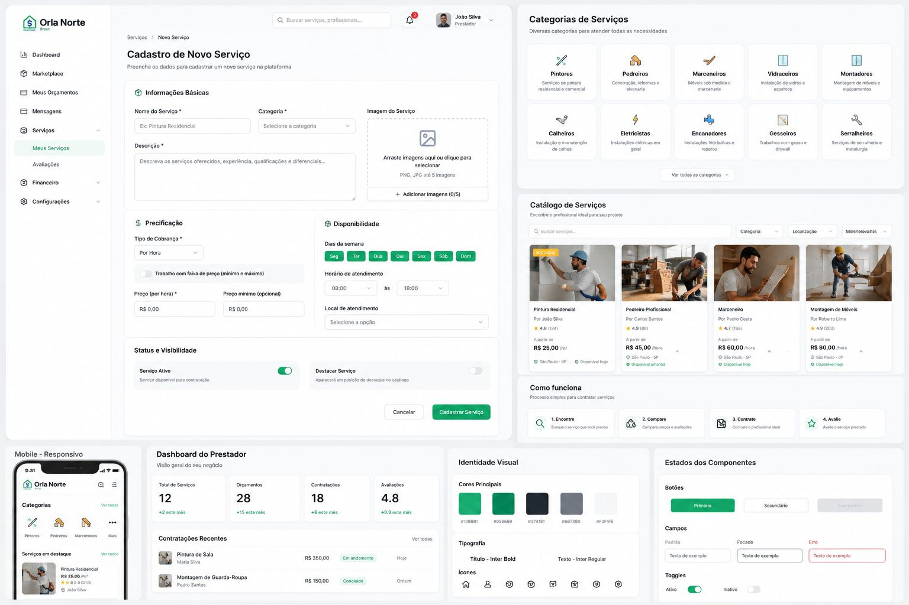

# OrçaNorte — Marketplace de Serviços + Orçamento Inteligente

> Plano final de implementação consolidado a partir dos dois briefings do cliente
> ([orcanorte-marketplace-servicos.md](orcanorte-marketplace-servicos.md) e
> [orcanorte-sistema-orcamento-inteligente.md](orcanorte-sistema-orcamento-inteligente.md))
> cruzado com o estado atual do código em [saas-cotacoes/](../saas-cotacoes/) (web + api + shared/database).



---

## 1. Resumo executivo

Construir um novo módulo dentro da OrçaNorte (a partir do app atual em `saas-cotacoes`) para
prestadores de serviços da construção civil, com:

- Catálogo de profissionais por categoria (Pedreiro, Pintor, Calheiro, etc.)
- Cadastro de serviço (form do prestador) — já existe base
- Perfil público do profissional com portfólio, avaliações e contato rápido
- Sistema de **Solicitação de Orçamento** (cliente → profissionais)
- **Orçamento Inteligente Automático** (calculadora por categoria)
- Filtros, badges, busca, responsividade mobile

O custo de implementação considera o que **já existe** no código vs. o que **precisa ser
construído** — boa parte da infraestrutura de serviços, categorias, lojas (= prestador),
reviews, favoritos, orders/cotações e auth já está pronta. O esforço maior é UX, formulários
guiados, motor de cálculo e novas rotas.

---

## 2. O que já existe no `saas-cotacoes`

### 2.1 Banco de dados ([shared/database/src/schema.ts](../saas-cotacoes/shared/database/src/schema.ts))

| Tabela | O que cobre do briefing |
| --- | --- |
| `stores` | Perfil do prestador (nome, slug, endereço, telefone, logo, coverImage, rating, totalReviews) |
| `services` | Cadastro de serviço (nome, categoria, preco, precoMinimo, precoMaximo, `tipoPrecificacao` ∈ hora/dia/projeto/m2/visita, imagemUrl, descricao, ativo, destacado) |
| `categories` | Categorias com `tipo` ∈ produto/servico, ícone, ordem |
| `reviews` | Avaliações ligadas a `serviceId` e `storeId` |
| `favorites` | Favoritar serviços/lojas |
| `orders` + `orderItems` | Cotação/Pedido com `tipo='cotacao'`, ligado a `serviceId` |
| `notifications` | Eventos (nova cotação, resposta, avaliação) |
| `measurementUnits` | Unidades (m, m², m³) — útil pro cálculo inteligente |

### 2.2 API ([saas-cotacoes/api/src/modules](../saas-cotacoes/api/src/modules))

- `catalog/presentation/http/services.routes.ts` — GET/POST de serviços
- `catalog/presentation/http/services-extra.routes.ts` — GET/PUT/DELETE `/:id` e `/:id/details`
- `catalog/application/commands/create-service.ts`
- `catalog/infrastructure/repositories/services.repository.ts`
- `reference/application/queries/list-service-providers.ts`
- `reference/application/queries/list-service-pricing-types.ts`
- `stores/presentation/http/fornecedor.routes.ts` (perfil público)
- `explorar/application/queries/get-marketplace-data.ts` (catálogo geral)

### 2.3 Web ([saas-cotacoes/web/src/modules](../saas-cotacoes/web/src/modules))

- `loja/catalogo/components/service-form.tsx` — formulário completo de serviço (356 linhas)
- `loja/dashboard` — dashboard do prestador (orders, métricas)
- `fornecedor/components/{desktop,mobile}/fornecedor.tsx` — perfil público do prestador (adaptive)
- `categoria/components/{desktop,mobile}` — listagem por categoria
- `explorar/components` — busca, filtros, cards adaptativos (`product-card-adaptive`)
- `explorar/components/ai-assistant` — assistente IA (reutilizável para orçamento guiado)

### 2.4 Conclusão da auditoria

≈60% do **Marketplace de Serviços** já tem fundação no código. O **Orçamento Inteligente
Automático** é praticamente todo novo (motor de cálculo + presets por categoria).

---

## 3. Gaps de schema (migrações novas)

Acrescentar à `shared/database/src/schema.ts`:

```ts
// Perfil estendido do prestador (1:1 com stores)
export const serviceProviderProfiles = pgTable('service_provider_profiles', {
  id: serial('id').primaryKey(),
  storeId: integer('store_id').references(() => stores.id).unique().notNull(),
  bio: text('bio'),
  experienciaAnos: integer('experiencia_anos'),
  areasAtendimento: jsonb('areas_atendimento').$type<string[]>().default([]), // cidades/CEPs
  atendimentoEmergencial: boolean('atendimento_emergencial').default(false),
  diasSemana: jsonb('dias_semana').$type<string[]>().default([]), // ['seg','ter',...]
  horarioInicio: varchar('horario_inicio', { length: 5 }),
  horarioFim: varchar('horario_fim', { length: 5 }),
  verificado: boolean('verificado').default(false),         // badge "Profissional Verificado"
  maisContratado: boolean('mais_contratado').default(false),// badge "Mais Contratado"
  melhorAvaliado: boolean('melhor_avaliado').default(false),// badge "Melhor Avaliado"
  createdAt: timestamp('created_at').defaultNow(),
  updatedAt: timestamp('updated_at').defaultNow(),
});

// Portfólio (antes/depois, trabalhos realizados)
export const servicePortfolio = pgTable('service_portfolio', {
  id: serial('id').primaryKey(),
  serviceId: integer('service_id').references(() => services.id),
  storeId: integer('store_id').references(() => stores.id).notNull(),
  titulo: text('titulo'),
  descricao: text('descricao'),
  imagensAntes: jsonb('imagens_antes').$type<string[]>().default([]),
  imagensDepois: jsonb('imagens_depois').$type<string[]>().default([]),
  createdAt: timestamp('created_at').defaultNow(),
});

// Cotação aberta (cliente solicita propostas a vários prestadores)
export const serviceQuoteRequests = pgTable('service_quote_requests', {
  id: serial('id').primaryKey(),
  userId: text('user_id').references(() => user.id).notNull(),
  categoria: varchar('categoria', { length: 100 }).notNull(),
  descricao: text('descricao').notNull(),
  imagens: jsonb('imagens').$type<string[]>().default([]),
  cep: varchar('cep', { length: 10 }),
  cidade: text('cidade'),
  urgencia: varchar('urgencia', { length: 20 }), // 'normal' | 'urgente' | 'emergencial'
  // Snapshot do orçamento inteligente (opcional)
  estimativaMin: decimal('estimativa_min', { precision: 10, scale: 2 }),
  estimativaMax: decimal('estimativa_max', { precision: 10, scale: 2 }),
  metadata: jsonb('metadata'), // medidas, acabamento, etc.
  status: varchar('status', { length: 20 }).default('aberta'), // 'aberta' | 'fechada' | 'cancelada'
  createdAt: timestamp('created_at').defaultNow(),
});

// Proposta enviada pelo prestador
export const serviceQuoteProposals = pgTable('service_quote_proposals', {
  id: serial('id').primaryKey(),
  quoteRequestId: integer('quote_request_id').references(() => serviceQuoteRequests.id).notNull(),
  storeId: integer('store_id').references(() => stores.id).notNull(),
  valor: decimal('valor', { precision: 10, scale: 2 }).notNull(),
  prazoEstimado: text('prazo_estimado'),
  mensagem: text('mensagem'),
  status: varchar('status', { length: 20 }).default('enviada'), // 'enviada' | 'aceita' | 'recusada'
  createdAt: timestamp('created_at').defaultNow(),
});

// Contratações fechadas
export const serviceContracts = pgTable('service_contracts', {
  id: serial('id').primaryKey(),
  proposalId: integer('proposal_id').references(() => serviceQuoteProposals.id).notNull(),
  userId: text('user_id').references(() => user.id).notNull(),
  storeId: integer('store_id').references(() => stores.id).notNull(),
  valor: decimal('valor', { precision: 10, scale: 2 }).notNull(),
  status: varchar('status', { length: 20 }).default('em_andamento'), // 'em_andamento' | 'concluida' | 'cancelada'
  iniciadoEm: timestamp('iniciado_em').defaultNow(),
  concluidoEm: timestamp('concluido_em'),
});

// Presets do orçamento inteligente (regras por categoria)
export const servicePricingPresets = pgTable('service_pricing_presets', {
  id: serial('id').primaryKey(),
  categoria: varchar('categoria', { length: 100 }).notNull(),  // 'pedreiro', 'pintor', etc.
  servico: varchar('servico', { length: 150 }).notNull(),      // 'reboco', 'pintura interna', etc.
  unidade: varchar('unidade', { length: 20 }).notNull(),       // 'm2', 'm_corrido', 'unidade', 'projeto'
  precoMinUnitario: decimal('preco_min_unitario', { precision: 10, scale: 2 }).notNull(),
  precoMaxUnitario: decimal('preco_max_unitario', { precision: 10, scale: 2 }).notNull(),
  tempoEstimadoUnitario: decimal('tempo_estimado_unitario', { precision: 6, scale: 2 }), // horas/unidade
  multiplicadores: jsonb('multiplicadores'), // ex.: { 'acabamento_premium': 1.4, 'altura>3m': 1.2 }
  regiao: varchar('regiao', { length: 2 }),  // UF (preço regional, opcional)
  ativo: boolean('ativo').default(true),
  createdAt: timestamp('created_at').defaultNow(),
});
```

Migração: criar `shared/database/drizzle/migrations/000X_service_marketplace.sql` via `bun run db:generate`.

---

## 4. Backend (API) — novas rotas

Localização: `saas-cotacoes/api/src/modules/`.

### 4.1 Estender `catalog` (serviços)

Já existe; só adicionar busca avançada:

- `GET /services?categoria=pedreiro&cep=01310&precoMax=...&disponivel=hoje&badge=verificado`
- `GET /services/featured` → cards "Mais Contratado" / "Melhor Avaliado" / destacados

### 4.2 Novo módulo `service-quotes`

```
api/src/modules/service-quotes/
  application/
    commands/
      create-quote-request.ts        # cliente abre solicitação
      send-proposal.ts               # prestador envia proposta
      accept-proposal.ts             # cliente aceita → cria service_contract
      close-contract.ts              # marca contratação como concluída
    queries/
      list-open-quotes-for-provider.ts
      list-my-quote-requests.ts
      list-proposals.ts
  infrastructure/
    repositories/
      quote-requests.repository.ts
      proposals.repository.ts
      contracts.repository.ts
  presentation/http/
    quote-requests.routes.ts
    proposals.routes.ts
    contracts.routes.ts
```

Endpoints chave:
- `POST   /quotes/requests`                  — criar solicitação (com upload de imagens)
- `GET    /quotes/requests/mine`             — minhas solicitações (cliente)
- `GET    /quotes/requests/open?categoria=`  — disponíveis pro prestador
- `POST   /quotes/requests/:id/proposals`    — prestador envia proposta
- `GET    /quotes/requests/:id/proposals`    — cliente vê propostas recebidas
- `POST   /quotes/proposals/:id/accept`      — aceitar (gera contract)
- `POST   /quotes/contracts/:id/complete`    — concluir contratação

### 4.3 Novo módulo `pricing-engine` (Orçamento Inteligente)

```
api/src/modules/pricing-engine/
  application/
    queries/
      get-presets.ts                # GET /pricing/presets?categoria=
      estimate-quote.ts             # POST /pricing/estimate
    services/
      compute-estimate.ts           # núcleo do cálculo
  presentation/http/
    pricing.routes.ts
```

Contrato de `POST /pricing/estimate`:

```ts
{
  categoria: 'pedreiro',
  servico: 'reboco',
  medidas: { metrosQuadrados: 45, alturaParede: 3, quantidadeParedes: 4 },
  acabamento: 'medio',  // 'simples' | 'medio' | 'premium'
  regiao: 'PA',
  urgencia: 'normal'
}
// → resposta
{
  estimativaMin: 1800,
  estimativaMax: 2700,
  tempoEstimadoDias: 4,
  materiaisAproximados: [{ nome: 'Argamassa', quantidade: 12, unidade: 'saco' }],
  profissionaisDisponiveis: 7,
  breakdown: [{ regra: 'reboco m²', minUnitario: 40, maxUnitario: 60, qty: 45 }]
}
```

`compute-estimate.ts` é puramente funcional → fácil de testar (Vitest).

---

## 5. Frontend (Web)

Localização: `saas-cotacoes/web/src/modules/`.

### 5.1 Reorganização do menu lateral

Editar `web/src/components/layout/sidebar.tsx` (verificar) e adicionar a seção **Serviços** com subitens:

- Meus Serviços → `/loja/servicos` (já existe via `catalogo` — só renomear/duplicar)
- Categorias → `/categoria` (existe)
- Orçamentos → `/orcamentos` (NOVO)
- Contratações → `/contratacoes` (NOVO)
- Avaliações → `/avaliacoes` (NOVO ou estender perfil)

### 5.2 Novo módulo `marketplace-servicos`

```
web/src/modules/marketplace-servicos/
  components/
    desktop/
      hero-categorias.tsx              # grid 4-coluna de categorias (mockup do briefing)
      catalogo-profissionais.tsx       # cards com foto + rating + valor inicial + CTAs
      como-funciona.tsx                # bloco "1.Encontre / 2.Compare / 3.Contrate / 4.Avalie"
      perfil-profissional.tsx          # extensão do fornecedor com portfólio + horários
    mobile/
      hero-categorias.tsx
      catalogo-profissionais.tsx
      perfil-profissional.tsx
    marketplace-adaptive.tsx           # padrão do projeto (desktop/mobile switch)
  hooks/
    use-service-categories.ts
    use-professionals.ts
    use-provider-profile.ts
  types.ts
  index.ts
```

Rotas (em `web/src/app/(routes)/`):
- `/servicos` — landing do marketplace de serviços (hero + categorias + destaques)
- `/servicos/categoria/[slug]` — listagem filtrada por categoria
- `/servicos/profissional/[slug]` — perfil público completo

### 5.3 Novo módulo `orcamento-inteligente`

```
web/src/modules/orcamento-inteligente/
  components/
    desktop/
      categoria-step.tsx       # 1. escolher categoria (Pedreiro, Pintor...)
      servico-step.tsx         # 2. tipo de serviço dentro da categoria
      medidas-step.tsx         # 3. medidas dinâmicas (campos vêm do preset)
      acabamento-step.tsx      # 4. acabamento + região + urgência
      resultado-step.tsx       # 5. faixa de preço + breakdown + profissionais
    mobile/...
    orcamento-inteligente-adaptive.tsx
    wizard.tsx                 # stepper compartilhado
    pdf-export.tsx             # reaproveita shared/pdf
    share-quote.tsx            # link compartilhável /orcamento/[id]
  hooks/
    use-pricing-estimate.ts    # debounce + react-query → POST /pricing/estimate
    use-pricing-presets.ts
  lib/
    field-builders.ts          # gera os campos dinamicamente a partir do preset
  types.ts
  index.ts
```

Rota: `/orcamento-inteligente` (landing + wizard), com URL state para deep-link
(`?categoria=pedreiro&servico=reboco&m2=45`).

Componentes reutilizáveis já no projeto: `Stepper`, `CurrencyInput`, `ImageUpload`,
`Dialog`, `Skeleton`, `Toast`. Já usa **react-hook-form + zod**.

### 5.4 Cadastro de serviço — ajustes incrementais

`web/src/modules/loja/catalogo/components/service-form.tsx` (já existe, 356 linhas) ganha:
- Aba **Disponibilidade** (dias da semana + horário + emergencial) → grava em
  `service_provider_profiles`
- Aba **Portfólio** (upload múltiplo antes/depois) → grava em `service_portfolio`
- Campo **Área de atendimento** (multi-select CEP/cidade)
- Campo **Experiência (anos)**

### 5.5 Perfil do profissional

Estender `web/src/modules/fornecedor/components/desktop/fornecedor.tsx` (709 linhas) com:
- Banner com `coverImage` + avatar + **badges** ("Verificado", "Mais Contratado", "Melhor Avaliado")
- Bloco **Portfólio** (carrossel embla — já no projeto)
- Bloco **Avaliações** (reuse `reviews`)
- CTA fixa "Solicitar Orçamento" → abre o `quote-request-dialog`

### 5.6 Componentes globais a adicionar

- `quote-request-dialog.tsx` — modal padrão (categoria → descrição → fotos → CEP → enviar)
- `badge-pro.tsx` — variantes "Verificado", "Mais Contratado", "Melhor Avaliado"
- `service-card.tsx` — card unificado (substitui adaptação do product-card pra serviços)
- `service-filter-bar.tsx` — busca + filtros (avaliação, preço, disponibilidade)

---

## 6. Identidade visual

Manter exatamente o padrão do mockup ([projects/orcanorte-marketplace-servicos.jpeg](projects/orcanorte-marketplace-servicos.jpeg)):

- Cores principais já configuradas no Tailwind: `#10B981` (verde primário), `#059669`, `#374151`, `#6B7280`, `#F3F4F6`
- Tipografia: **Inter Bold** para títulos, **Inter Regular** para texto (`geist` já instalado — verificar se trocar pra Inter ou ajustar tokens)
- Cards minimalistas, bordas suaves (`rounded-2xl`), sombras leves (`shadow-sm`)
- Ícones via `lucide-react` (já instalado) — Hammer (pedreiro), PaintRoller (pintor), Drill, etc.

---

## 7. Responsividade

Já existe o padrão `*-adaptive.tsx` no projeto. Aplicar:
- Desktop: grid 4–6 colunas, sidebar persistente
- Tablet: 2–3 colunas, sidebar colapsável
- Mobile: 1 coluna, navegação inferior, cards verticais grandes, botões >= 48px

---

## 8. Ordem de entrega sugerida

| Sprint | Entregáveis |
| --- | --- |
| **S1 — Foundation** (1 sem) | Migração de schema (5 tabelas novas); seed de `categories` (17 categorias do briefing) e `service_pricing_presets` iniciais |
| **S2 — Marketplace UI** (2 sem) | `/servicos` landing + grid de categorias + catálogo de profissionais + filtros + cards |
| **S3 — Perfil & Cadastro** (1 sem) | Perfil estendido do profissional (portfólio, badges, disponibilidade) + extensão do `service-form` |
| **S4 — Solicitação de Orçamento** (1,5 sem) | `service-quotes` (API + UI) + dialog cliente + dashboard do prestador (propostas a enviar) |
| **S5 — Orçamento Inteligente** (2 sem) | `pricing-engine` (API + presets) + wizard 5 steps + breakdown + export PDF + link compartilhável |
| **S6 — Polish & QA** (1 sem) | Mobile pass, acessibilidade, e2e Cypress dos fluxos críticos, deploy |

**Total estimado: ≈ 8,5 semanas / 2 meses corridos**.

---

## 9. Valor

> Cliente pequeno, implementação assistida por Claude Code. Cobrança só do desenvolvimento à hora de **R$ 120,00**. Testes (mobile pass, a11y, Cypress e2e, QA) **estão inclusos — feitos sem custo adicional**.

| Frente | h dev |
| --- | --- |
| Schema + migrações + seeds | 3 |
| API: `service-quotes` + extensão `catalog` | 6 |
| API: `pricing-engine` + presets | 5 |
| Web: `/servicos` landing + categorias + catálogo | 7 |
| Web: perfil profissional estendido + cadastro | 5 |
| Web: solicitação de orçamento (dialog + dashboard) | 6 |
| Web: wizard de orçamento inteligente + PDF + share | 8 |
| **Total dev** | **40 h** |

**Total: 40 h × R$ 120 = R$ 4.800,00**

Testes (mobile pass, a11y, Cypress e2e, QA) estão **inclusos** na entrega — não geram cobrança extra.

---

## 10. Etapas de pagamento (2 × R$ 2.400)

Cobrança em duas etapas iguais, cada uma amarrada a entregas concretas e auditáveis (sobe pra `master` da `saas-cotacoes` no fim de cada etapa).

### Etapa 1 — Marketplace de Serviços · R$ 2.400 (20 h) · pago no kickoff

Entregas (tudo navegável e funcional em staging ao final):

1. **Schema & dados** (3 h)
   - Migração Drizzle com as 6 tabelas novas (`service_provider_profiles`, `service_portfolio`, `service_quote_requests`, `service_quote_proposals`, `service_contracts`, `service_pricing_presets`)
   - Seed das **17 categorias** do briefing (Pedreiro, Pintor, Marceneiro, Vidraceiro, Calheiro, Eletricista, Encanador, Gesseiro, Montador de Móveis, Serralheiro, Jardineiro, Instalador de Piso, Azulejista, Servente, Soldador, Técnico em Refrigeração, Limpeza Pós-Obra) com ícones

2. **API** (6 h)
   - Extensão do módulo `catalog`: filtros por categoria, CEP/região, faixa de preço, badge, disponibilidade em `GET /services`
   - Módulo novo `service-quotes`: rotas `POST /quotes/requests`, `GET /quotes/requests/{mine|open}`, `POST /quotes/requests/:id/proposals`, `POST /quotes/proposals/:id/accept`

3. **Web — `/servicos` (landing do marketplace)** (7 h)
   - Hero com **grid de categorias visuais** (cards com ícone + contagem de profissionais) idêntico ao mockup
   - **Catálogo de profissionais** em cards (foto, rating, valor inicial, badges) com busca, filtros (avaliação, preço, disponibilidade) e ordenação
   - Bloco "Como funciona" (Encontre → Compare → Contrate → Avalie)
   - Responsivo desktop/tablet/mobile

4. **Perfil público do profissional + ajustes no form** (4 h)
   - Página `/servicos/profissional/[slug]` com cover, avatar, **badges** ("Verificado", "Mais Contratado", "Melhor Avaliado"), portfólio (antes/depois em carrossel), lista de avaliações
   - Extensão do `service-form` existente: abas Disponibilidade (dias/horário/emergencial), Portfólio (upload múltiplo), Área de atendimento, Experiência

**Critério de aceite Etapa 1:** cliente consegue navegar em `/servicos`, filtrar profissionais por categoria/preço/badge, abrir perfil completo e ver portfólio — **sem ainda solicitar orçamento**.

---

### Etapa 2 — Orçamento Inteligente + Contratação · R$ 2.400 (20 h) · pago na entrega

Entregas:

1. **API `pricing-engine`** (5 h)
   - Endpoint `POST /pricing/estimate` (categoria, serviço, medidas, acabamento, região, urgência → faixa min/max, tempo estimado, materiais aproximados, profissionais disponíveis, breakdown)
   - Seed de `service_pricing_presets` cobrindo Pedreiro, Pintor, Calheiro, Telhado, Marceneiro e Vidraceiro (conforme briefing 2)

2. **Wizard de Orçamento Inteligente** (5 h)
   - Página `/orcamento-inteligente` com 5 steps:
     1. Categoria do serviço
     2. Tipo de serviço (campos vêm do preset)
     3. Medidas dinâmicas (m², metro corrido, altura, quantidade, etc.)
     4. Acabamento + região + urgência
     5. **Resultado**: faixa de preço min/max, tempo estimado, materiais, profissionais disponíveis
   - Atualização em tempo real (debounce) conforme o usuário muda valores

3. **Solicitação de Orçamento + Dashboard do prestador** (6 h)
   - Dialog "Solicitar Orçamento" (categoria → descrição → upload de fotos → CEP → enviar) acessível do perfil e do resultado do wizard
   - Tela `/orcamentos` do **cliente**: lista solicitações abertas e propostas recebidas, com botões aceitar/recusar
   - Tela `/orcamentos/recebidos` do **prestador**: lista solicitações abertas na categoria dele, envia proposta (valor + prazo + mensagem)
   - Tela `/contratacoes`: contratos em andamento e concluídos (ambos os lados)
   - Notificações via tabela `notifications` (nova proposta, proposta aceita, contrato concluído)

4. **PDF + share + mobile pass** (4 h)
   - Export do orçamento em PDF (reaproveita `shared/pdf/quote-pdf-template.ts`)
   - Link compartilhável `/orcamento/[id]` (rota pública leitura-só)
   - Revisão mobile dos novos fluxos (cards verticais, botões >= 48 px, navegação simplificada)
   - Atualização do menu lateral com a nova seção Serviços (Meus Serviços / Categorias / Orçamentos / Contratações / Avaliações)

**Critério de aceite Etapa 2:** cliente consegue gerar orçamento estimado pelo wizard, abrir solicitação real, receber propostas de prestadores, aceitar uma, finalizar contratação e baixar PDF — fluxo end-to-end completo.

---

## 10. Riscos / dependências

- **Dados de preços regionais** (`service_pricing_presets`): exige curadoria manual inicial + revisão trimestral. Recomendar parceria com SINAPI/CUB pra ancorar valores.
- **Verificação de profissionais**: definir critério (documentos, CNPJ, comprovantes) antes do badge "Verificado".
- **Pagamento dentro da plataforma**: hoje o `orders` já integra Mercado Pago e Stripe; para contratação de serviço pode-se reaproveitar `subscriptions`/`orders` ou criar `service-payments` se o modelo for split.
- **Upload de imagens** (portfólio, antes/depois): confirmar Supabase Storage suporta volume estimado — caso contrário, R2.

---

## 11. Artefatos entregues neste planejamento

- [orcanorte-marketplace-servicos.md](orcanorte-marketplace-servicos.md) — briefing original do marketplace
- [orcanorte-sistema-orcamento-inteligente.md](orcanorte-sistema-orcamento-inteligente.md) — briefing original do orçamento
- [projects/orcanorte-marketplace-servicos.jpeg](projects/orcanorte-marketplace-servicos.jpeg) — mockup de referência (UI alvo)
- **Este documento** — plano consolidado de implementação + valor
